## Connecting Cloudera Hive to JBoss Data Virtualization

1. [Connect Hive to JDV](#connect)
2. [Edit the Source Model](#source)
3. [Create the View Model](#view)
4. [Deploy the VDB](#deploy)
5. [Consume the data via REST](#consume)
6. [Special](#fix)

This guide is a follow on to [Unlock your Hadoop data with Hortonworks and Red Hat JBoss Data Virtualization](https://developers.redhat.com/blog/2016/11/16/unlock-your-hadoop-data-with-hortonworks-and-red-hat-jboss-data-virtualization/). That guide covered a Hortonworks implementation whereas this guide will cover a Cloudera based implementation.

### Setup
* Download [Cloudera all in one vm](https://www.cloudera.com/downloads/quickstart_vms/5-10.html) for the Virtualization platform you have installed. This example was done on [VirtualBox](https://www.virtualbox.org/)
* You will need to populate your Hive instance. This example works off the data from the [Getting Started with Hadoop Tutorial](https://www.cloudera.com/developers/get-started-with-hadoop-tutorial/exercise-1.html)
* Install [JBoss Data Virtualization](https://developers.redhat.com/products/datavirt/download/) (JDV). Make sure the odata role is configured

You need to create a Cloudera datasource outside of the teiid designer in order to connect to hive. This project brings the libraries from the [2.5.18 Cloudera JDBC 4.1 driver](https://www.cloudera.com/downloads/connectors/hive/jdbc/2-5-18.html).

Run the `cli.sh` script with the `add all` option to create and/or remove the module,driver and datasource.  You need to set the path to your **jboss home directory** in the **cli.sh** script  You will also need to tweak the **cli/add-ds.cli** for your specific hive connection information.

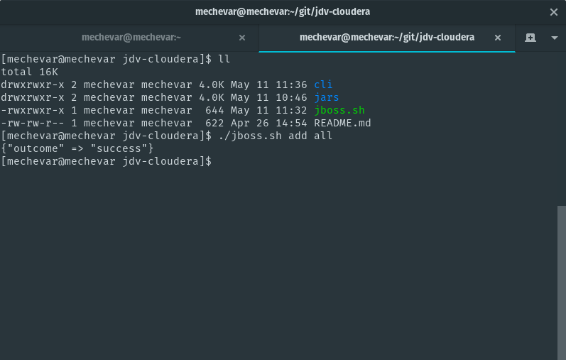

To verify the datasource is correct, test the datasource connection in the [jboss admin console](http://localhost:9990/console).

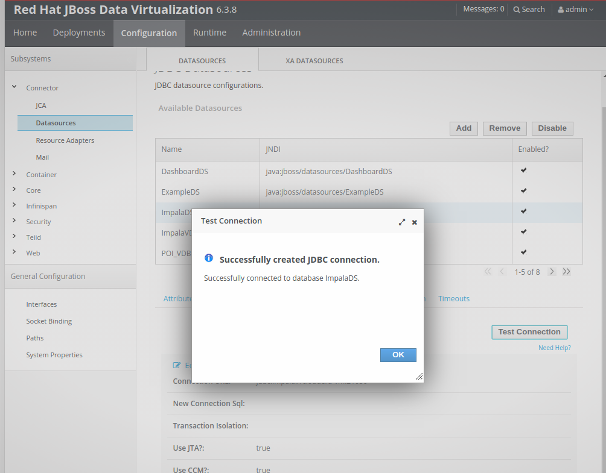

### Connect Hive to JDV
* new -> teiid model project
* server panel -> start the jdv server. Make sure the admin and jdbc connections are set with the proper user/pass

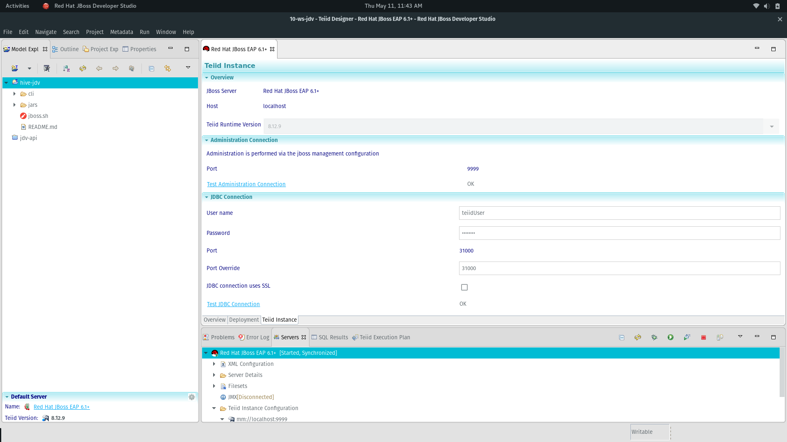

* file -> import -> teiid connection >> source model
* select the **HiveDS** that was created by the script, next
* make sure the hive translator is selected, next

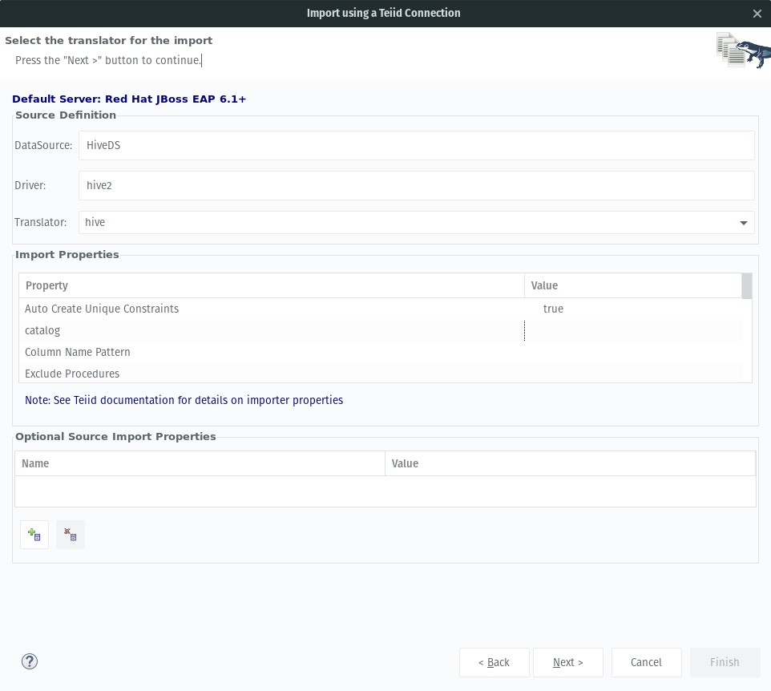

* name the source model: HiveDS, next
* you should see the sample ddl, next

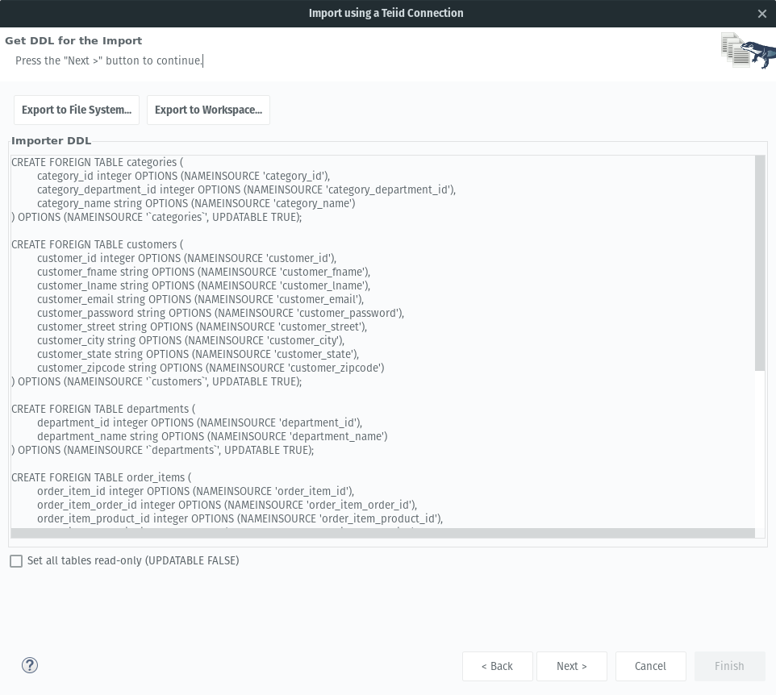

* for this example we are only going to import the **customers** table

### Edit the Source Model
* on the new datasource model, right-click and select new child -> primary key (pk_id)

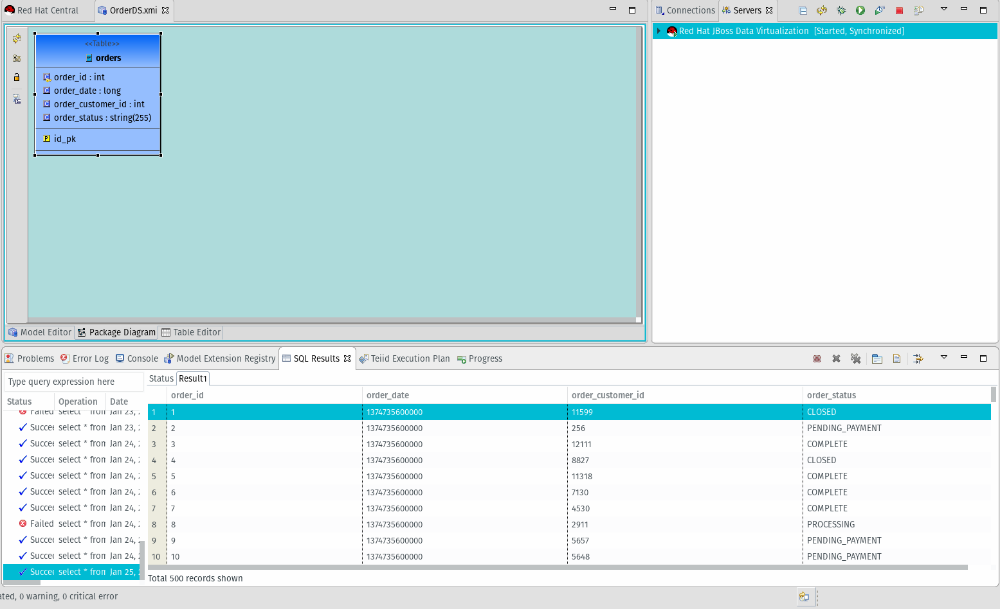

* in the properties for the pk_id, reference the id column

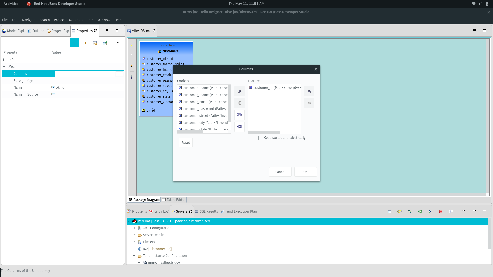

* in the properties for the id column, select **no nulls** for the nullable property
* set the length field for all the other properties to **255**
* after saving there should no longer be any warnings on your model

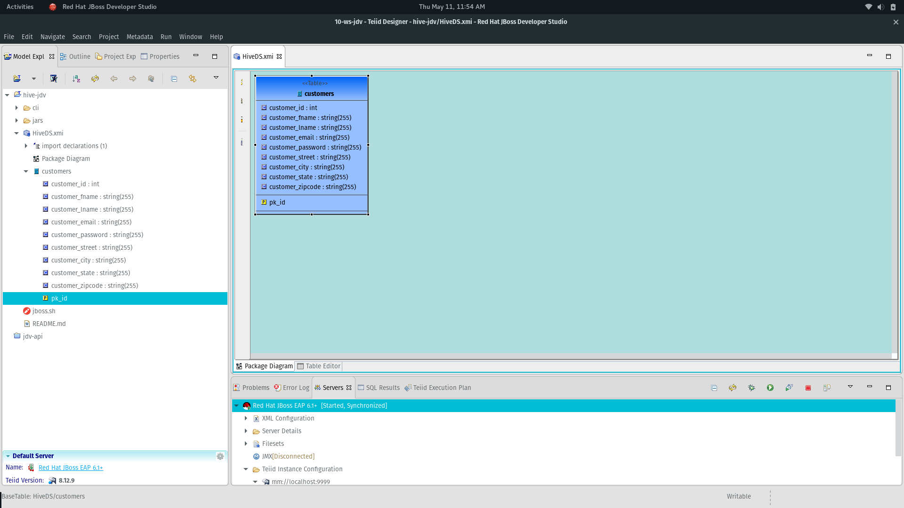

* verify the source model, right-click and select modeling -> preview data. the SQL Results pane will show the data

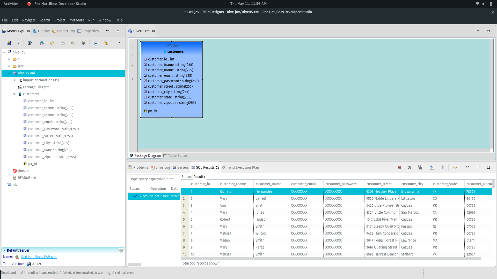

### Create the View Model
* file -> new -> teiid metadata model
* Name: HiveView, model class: relational, model type: view. Select transform from existing model and next

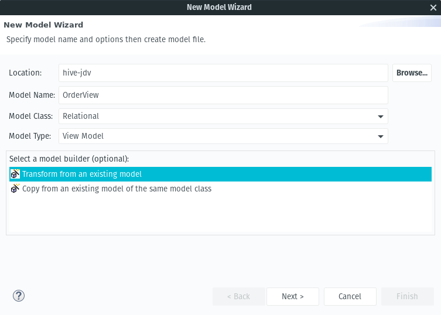

* Select the HiveDS model and finish

### Deploy the VDB
* file -> new -> teiid vdb
* select the HiveView to add and finish. As of this post you will need to do the [Fix](#fix) instructions to fix a bug.

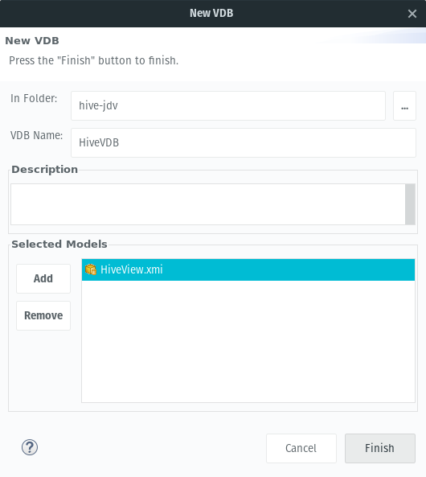

* right-click the vdb select modeling -> deploy

### Consume the data via REST
* For this example, [postman](https://www.getpostman.com/) was used to test
* An example url for a local server is (http://localhost:8080/odata4/HiveVDB/HiveView/customers?$count=true)
* You will need to set the basic auth params to connect

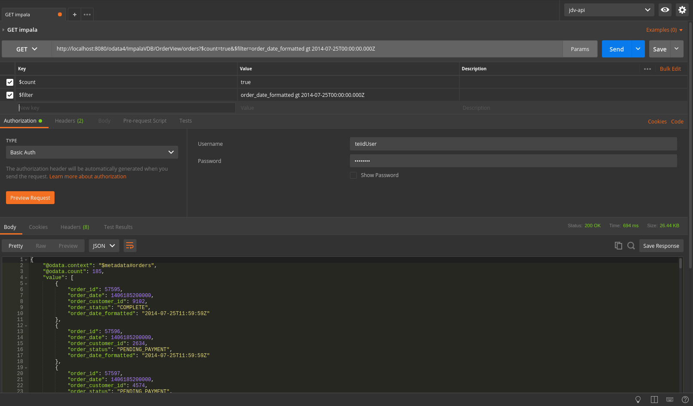

### Special Fix

There is currently a performance bug in the hive translator.  To fix you need to create an override in your VDB for the hive translator and set the **orderBy** option to **false**.  Then in your VDB select the overriden translator for the **HiveDS** model.

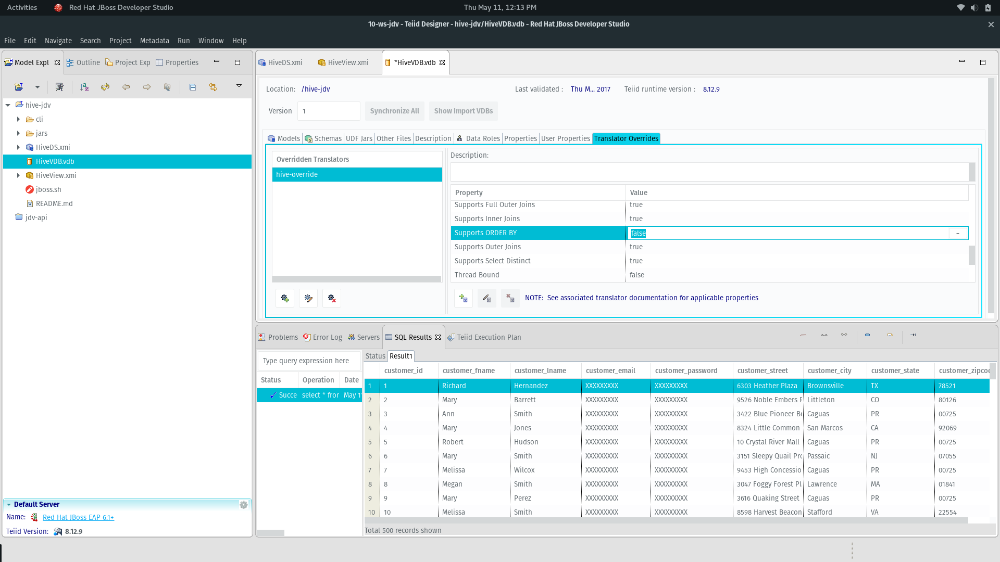

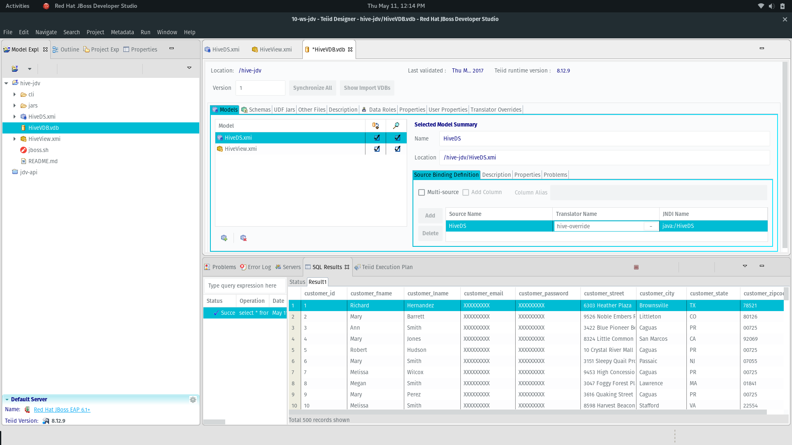
