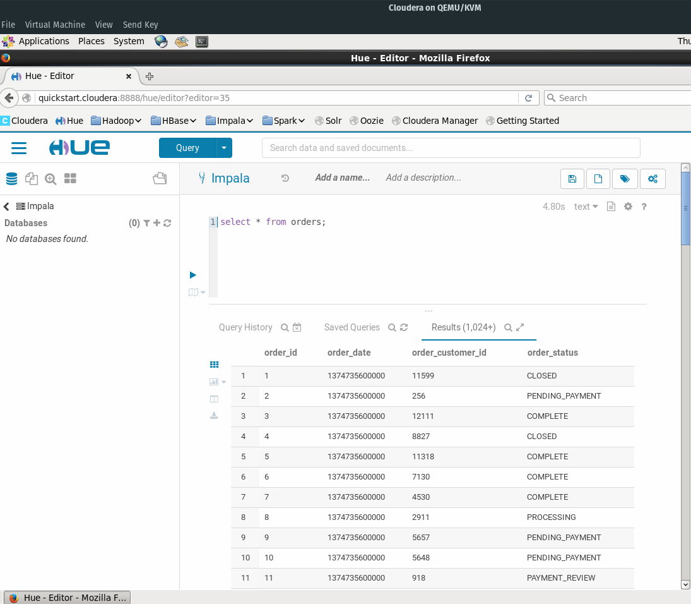
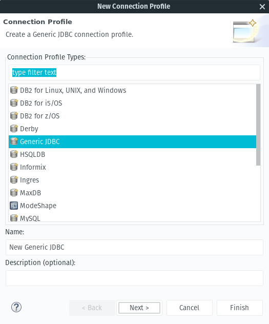
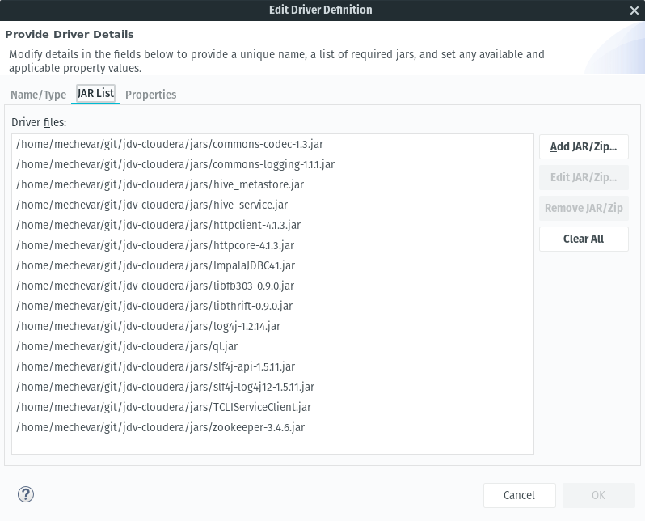
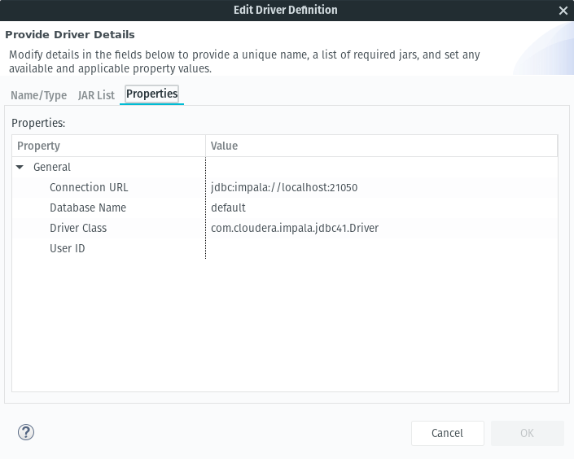
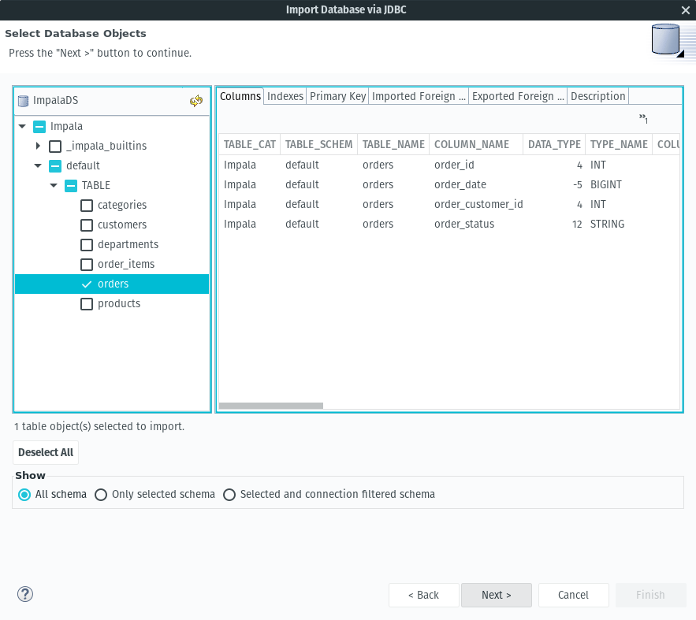
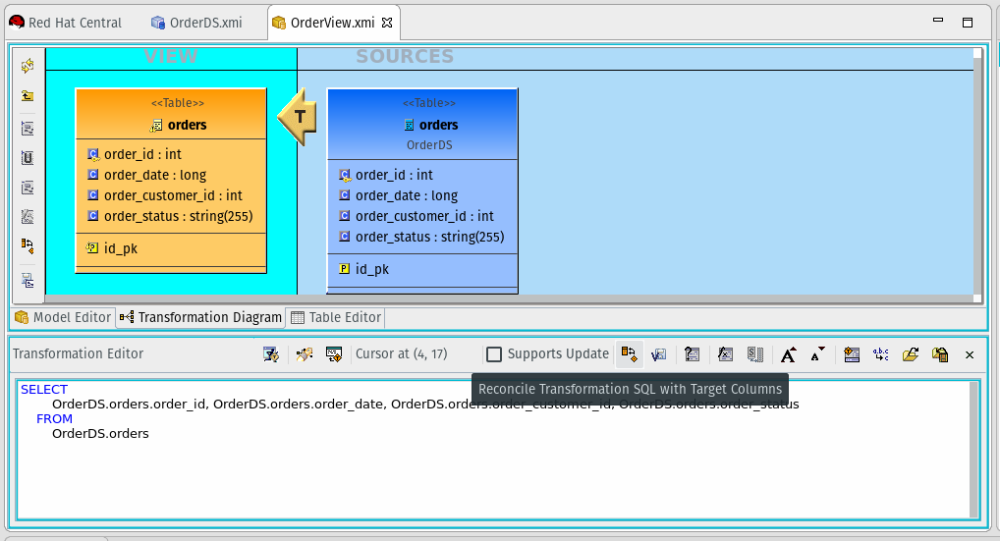
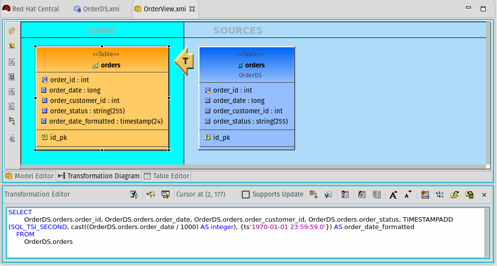

## JBoss Data Virtualization: Integrating with Impala on Cloudera

1. [Connect Impala to JDV](#connect)
2. [Check the Source Model](#source)
3. [Create the View Model](#view)
4. [Add a custom property to the view](#custom)
5. [Deploy the VDB](#deploy)
6. [Consume the data service via REST](#consume)

This guide is a follow on to [Unlock your Hadoop data with Hortonworks and Red Hat JBoss Data Virtualization](https://developers.redhat.com/blog/2016/11/16/unlock-your-hadoop-data-with-hortonworks-and-red-hat-jboss-data-virtualization/). That guide covered a Hortonworks implementation connection to Hive where this guide will cover a Cloudera based implementation connection to Impala.  The goal is to import data, do a transform in realtime on a column and finally consume and filter the data servcie via REST.

### Setup
* Download [Cloudera all in one vm](https://www.cloudera.com/downloads/quickstart_vms/5-10.html) for the Virtualization platform you have installed. This example was done on [KVM](https://www.linux-kvm.org/)
* You will need to populate your Impala instance. This example works off the data from the [Getting Started with Hadoop Tutorial](https://www.cloudera.com/developers/get-started-with-hadoop-tutorial/exercise-1.html)
* We are going to be importing data from the **Orders** table.  Go to the Impala interface in Cloudera HUE and verify that the example data was loaded successfully.



* Install [JBoss Data Virtualization](https://developers.redhat.com/products/datavirt/download/) (JDV). Make sure the odata role is configured

* You need to create a Cloudera datasource outside of the teiid designer in order to connect to hive. This project brings the libraries from the [Impala JDBC Connector 2.5.42 for Cloudera Enterprise](https://www.cloudera.com/downloads/connectors/impala/jdbc/2-5-42.html).

* Clone the [jdv-cloudera](https://github.com/mechevarria/jdv-cloudera) repo to get some helper scripts with creating datasources on the JDV server.

	`git clone https://github.com/mechevarria/jdv-cloudera`

* Run the `cli.sh` script with the `add all` option to create and/or remove the module,driver and datasource.  You need to set the path to your **jboss home directory** in the **cli.sh** script  You will also need to tweak the **cli/add-ds.cli** for your specific impala connection information.


* To verify the datasource is correct, test the datasource connection in the [jboss admin console](http://localhost:9990/console).


### Connect Impala to JDV<a name="connect"></a>
* `new -> teiid model project`
* `server panel -> start the jdv server`. Make sure the admin and jdbc connections are set with the proper user/pass


* In the designer we are going to use the propietary Cloudera Impala driver instead of the builtin translator
* `file -> import -> JDBC Database >> source model`
* Select **New** Connection Profile
* Select **Generic JDBC** and then **next**



* Select the **New Driver Definition** button
* Under the **JAR List** tab, add all of the jars from the [jars](https://github.com/mechevarria/jdv-cloudera/tree/master/jars) directory



* Under the properties tab update the **Driver Class** to be `com.cloudera.impala.jdbc41.Driver` and the connection url to be `jdbc:impala://localhost:21050`



* After selecting **ok** and returning to the connection profile, change **localhost** to the hostname of the impala server.  In my case it was **cloudera-vm**
* Set the username and password.  For the quickstart vm both values are **cloudera**
* Select **Next** and then select the **orders** table for import



* Set **Model Name** to `OrderDS.xmi` and set the **JNDI Name** to `java:/OrderDS`
* Selecting **Finish** will create the source model


### Check the Source Model<a name="source"></a>
* **right-click** and select **modeling -> preview data**. the **SQL Results** pane will show the data


### Create the View Model<a name="view"></a>
* Select **file -> new -> teiid metadata model**
* **Name:** `OrderView`, **model type:** `view`. Select **transform from existing model** and **next**
* Select the **OrderDS** model and select **finish**


### Add a custom property to the view<a name="custom"></a>

* We are going to transform the order date column from a long value in milliseconds into a timestamp that can be filtered by a client application.
* Double click the **T** in the **OrderView** modeling diagram and then select the **Reconcile SQL Transformation** button.



* Select the **plus button** Then select **order_date**
* Select the  **<new** button and then rename the field to `order_data_formatted`
* Select **ok**
* In the **Transformation Editor** replace the value `OrderDS.orders.order_date` with `TIMESTAMPADD(SQL_TSI_SECOND, cast((OrderDS.orders.order_date / 1000) AS integer), {ts'1970-01-01 23:59:59.0'})`
* For reference, these are the available [Date/Time Functions](https://docs.jboss.org/author/display/TEIID/Date_Time+Functions)
* Select the **Save and Validate** button.
* Save the updated View model
* The complete transformation query should be 

```sql
SELECT
		OrderDS.orders.order_id, 
		OrderDS.orders.order_date, 
		OrderDS.orders.order_customer_id, 
		OrderDS.orders.order_status, 
		TIMESTAMPADD(SQL_TSI_SECOND, cast((OrderDS.orders.order_date / 1000) AS integer), {ts'1970-01-01 23:59:59.0'}) AS order_date_formatted
	FROM
		OrderDS.orders
```



### Deploy the VDB<a name="deploy"></a>
* **file -> new -> teiid vdb**
* Name the vdb **ImpalaVDB**
* select the **OrderView** to add and finish. This will automatically bring the **OrderDS** as well.


* To deploy, select the **Deploy** button.  

### Consume the data service via REST<a name="consume"></a>
* For this example, [Postman](https://www.getpostman.com/) was used to test
* An example url for a local server is (http://localhost:8080/odata4/ImpalaVDB/OrderView/orders?$count=true)
* You will need to set basic auth params (user/pass) for the **teiidUser**.
* Under the **Authorization tab** select **Basic Auth** and then enter the credentials on the right
* To filter the records, select **Params** next to the **Send** button and a param named **$filter** and its value to `order_date_formatted gt 2014-07-25T00:00:00.000Z`
* This will filter results with a timestamp greater than 2014-07-25.  More details on OData parameters and usage can be found on [OData.org](http://www.odata.org)


